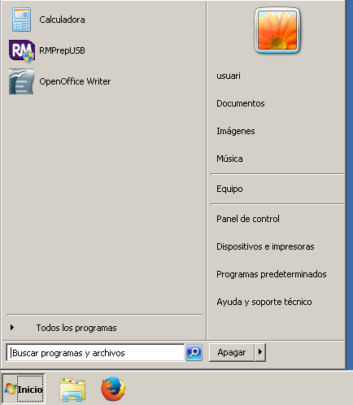
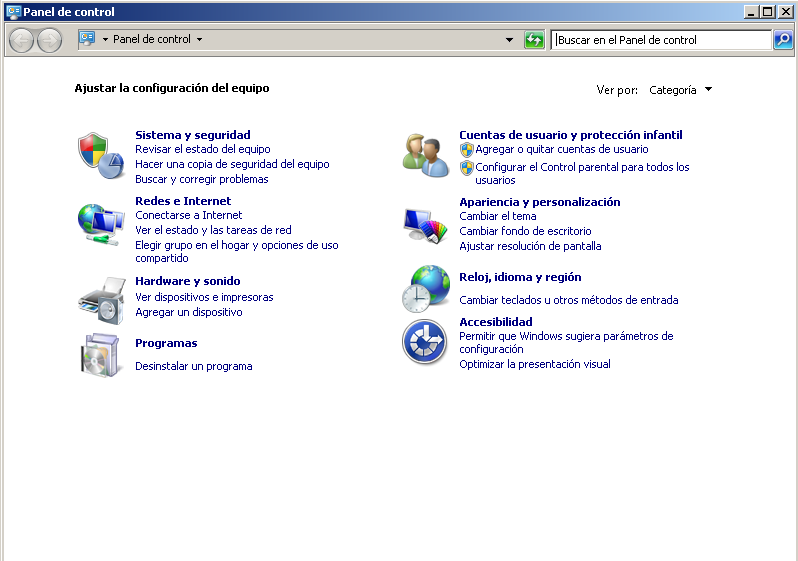
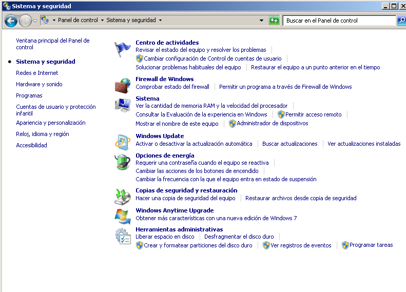

# TALLAFOCS
**1. Tallafocs**
    
    ·Què es un sistema tallafocs? Quina és la seva finalitat?
        És un element de maquinari o programari utilitzat en una xarxa d'equips informàtics. 
        La seva finalitat és permetre o prohibir les comunicacions que hi entren al nostre PC.
    
    ·Quines generacions de tallafocs hi ha hagut i què millorava cadascun?
        1-Tallafocs de xarxa: filtratge de paquets
        2-Tallafocs d'estat: la colocació de cada paquet individual dins d'una serie de paquets
        3-Tallafocs d'aplicació: permet detectar si un protocol no deseat es cola a través d'un port no estàndar o si s'està abusan d'un protocol de forma perjudicial.
        
    ·Quines capes té el model OSI?
        Tè 7:
        7-Capa d'aplicació
        6-Capa de presentació
        5-Capa de sessió
        4-Capa de transport
        3-Capa de xarxa
        2-Capa d'enllaç de dades
        1-Capa física
        
    ·Quines capes té el model TCP/IP? En aquest cas feu una breu descripció de les funcionalitats de cada capa.
        Tè 4:
            4-Capa d'aplicació: aquesta capa agafa les capes 7, 6 i 5 del model OSI, proporciona serveis als usuaris.
            3-Capa de transport: aquesta capa només agafa la capa 4 del model OSI, s'encarrega de la transferència lliure d'errors de les dades entre l'emisor i el receptor.
            2-Capa de internet: aquesta capa només agafa la capa 3 del model OSI, defineix els datagrames i administra les nocions de direccions IP. Permet l'enrutament de datagrames a equips remots junt amb l'administració de la seva divisió i ensamblatge quan es rep.
            1-Capa d'accés a la xarxa: aquesta capa agafa les capes 2 i 1 del model OSI, ofereix la capacitat d'accedir a qualsevol xarxa física, es a dir, brinda els recursos que es deben d'implementar per a transmetre dades a través de la xarxa.
            
    ·A quina capa/capes sol treballar tradicionalment un tallafocs?
        Sol treballar per la 4 i la 3:
        La 3 per IP's.
        La 4 per ports.

**2. Tallafocs Linux**

    ·Busqueu quins són els tradicionals sistemes de tallafocs incorporats en linux i anomeneu-los
        -Netfilter
        -IPtables
        -Ufw
        -FirewallD
        -Fail2ban
        
    ·Quins dels anteriors tallafocs estan instal.lats al fedora de classe? Com ho comproveu?
        IPtables, amb IPtables --list
        
    ·Algun dels anteriors tallafocs es troba activat?
        No
        
    ·Instal.leu el servidor web httpd o nginx i activeu-ne el servei (dnf installl ...  ; systemctl ....). Indiqueu les comandes i comproveu que des d'una altra màquina podeu accedir via web a la vostra IP (digueu-li a un company). Hauria de sortir la plana per defecte.
        dnf install -y nginx
        systemctl active nginx.service
        
    ·Activeu el servei firewalld. Indiqueu com ho feu.
        systemctl start firewalld.service
     
**3. Win 7**

    ·Porta aquest SO algun tallafocs incorporat?
        Si
        
    ·Arrenqueu una màquina win7 a isard.escoladeltreball.org
    
    ·Indiqueu com arribar al tallafocs (passos i pantalles)
    
1-Panel de control

        
2-Sistema y seguridad

        
3-Firewall de Windows

     
        
    ·Es troba activat en aquest windows?
        Si
